# WarpCore + WarpFlow — System Architecture

## 1. High-Level System Architecture

The system consists of **three Docker services** and a **cloud-hosted database**, all orchestrated via Docker Compose.

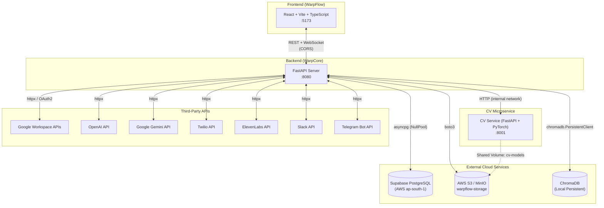

---

## 2. Docker Compose Deployment

| Service | Port | Context | Key Details |
|---|---|---|---|
| **warpcore** | `8080` | `./warpcore` | Main API; depends on `cv-service` health |
| **cv-service** | `8001` | `./warpcore/app/services/cv` | Training & inference; healthcheck at `/health` |
| **cv-service-gpu** *(optional)* | `8001` | Same as above, `Dockerfile.gpu` | NVIDIA GPU reservation (`count: 1`) |

**Shared resources:**
- **Network:** `warpcore-network` (bridge driver)
- **Volumes:** `cv-models` (shared between warpcore & cv-service), `./datasets` bind mount

---

## 3. Agent & Tool Orchestration Flow

The **AI Agent** is the central orchestrator. Users build visual workflows by connecting nodes on a canvas. At execution time, the **WorkflowEngine** picks the agent node, resolves connected service nodes, registers tools, and runs an LLM function-calling loop.

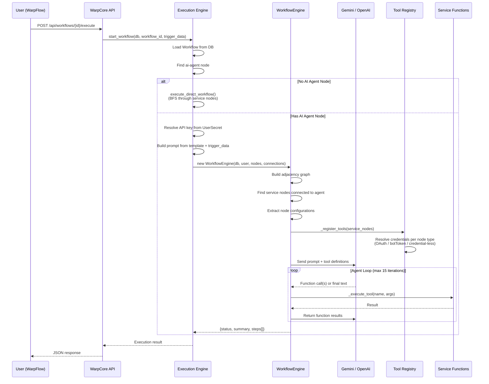

### Tool Registry Architecture

The `TOOL_REGISTRY` maps **node types → tool definitions**. Each tool has a name, description, JSON Schema parameters, and an `_fn` reference.

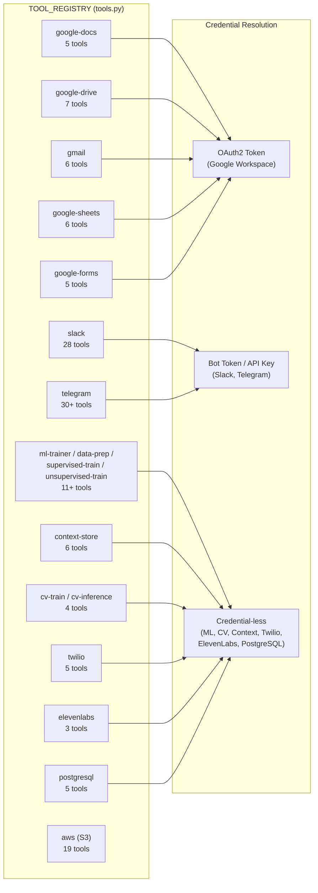

### Credential-Less Tools flow
For `CREDENTIAL_LESS_TOOLS`, the engine passes the **user_id** instead of an OAuth token, and the wrapper function fetches secrets from the `UserSecret` table at call time.

---

## 4. Workflow Triggers & Execution Paths

Workflows can be triggered multiple ways:

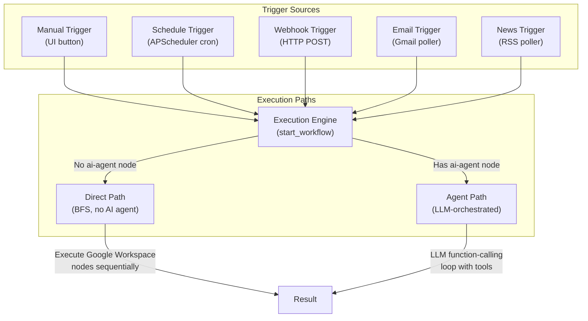

### Background Pollers (Lifespan)

| Poller | Function | Interval |
|---|---|---|
| **Scheduler** | `APScheduler` with `AsyncIOScheduler` | Cron-based per workflow |
| **Email Poller** | Polls Gmail for new emails | Configurable |
| **News Poller** | Polls RSS/News feeds | Configurable |

---

## 5. CV Training & Inference Pipeline

### 5.1 CV Microservice Architecture

The CV service is a **standalone FastAPI microservice** running on port 8001 with its own PyTorch environment.

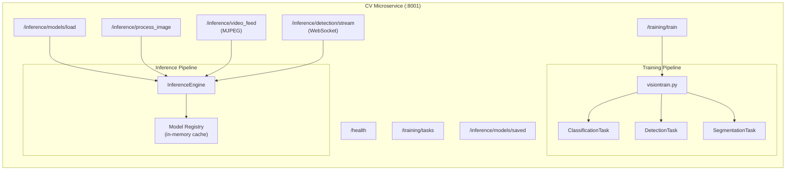

### 5.2 CV Training — Supported Models & Methods

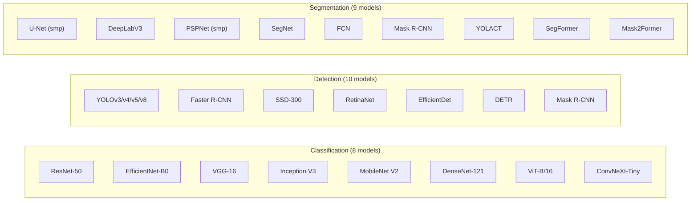

### 5.3 CV Training Flow

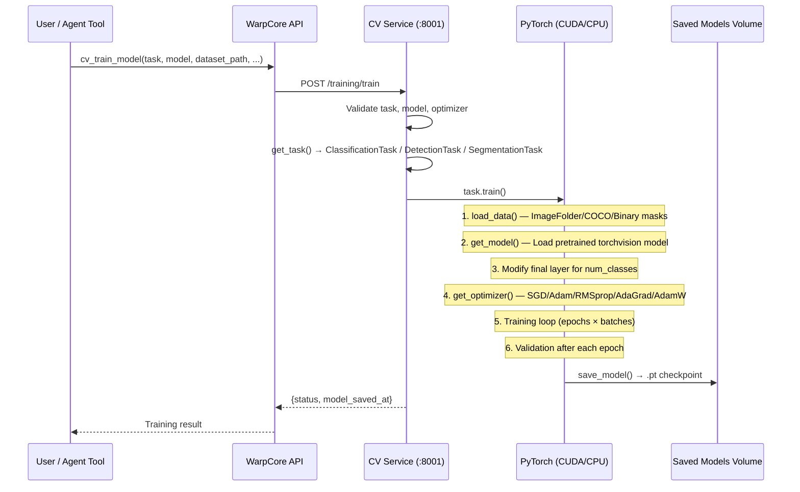

### 5.4 CV Inference Flow

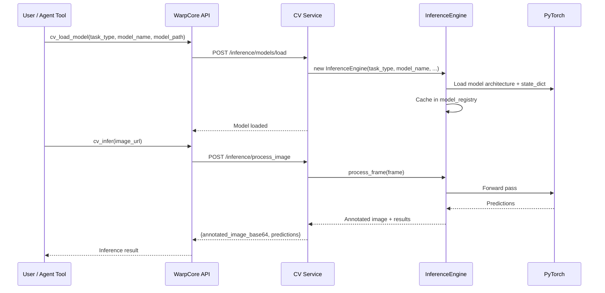

### 5.5 Segmentation Dataset Formats

| Format | Detection Method | Handler Class |
|---|---|---|
| **COCO** | `_annotations.coco.json` present | `CocoSegmentationDataset` |
| **Binary** | `images/` + `masks/` dirs | `BinarySegmentationDataset` |
| **Multiclass** | `labels.txt` file present | `MulticlassSegmentationDataset` |

### 5.6 GPU Requirements

| Mode | Requirement | Configuration |
|---|---|---|
| **CPU Training** | Default `cv-service` container | Slower, no GPU needed |
| **GPU Training** | `cv-service-gpu` + NVIDIA Container Toolkit | `CUDA_VISIBLE_DEVICES=0`, `driver: nvidia`, `count: 1` |
| **Inference** | Auto-detects via `torch.cuda.is_available()` | Falls back to CPU if no GPU |

---

## 6. ML Training Pipeline (scikit-learn)

The ML pipeline runs **inside WarpCore** (no separate microservice). It uses scikit-learn and CatBoost for tabular data.

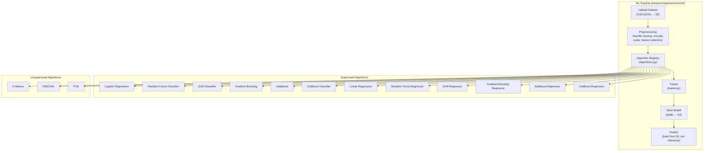

### ML Data Flow

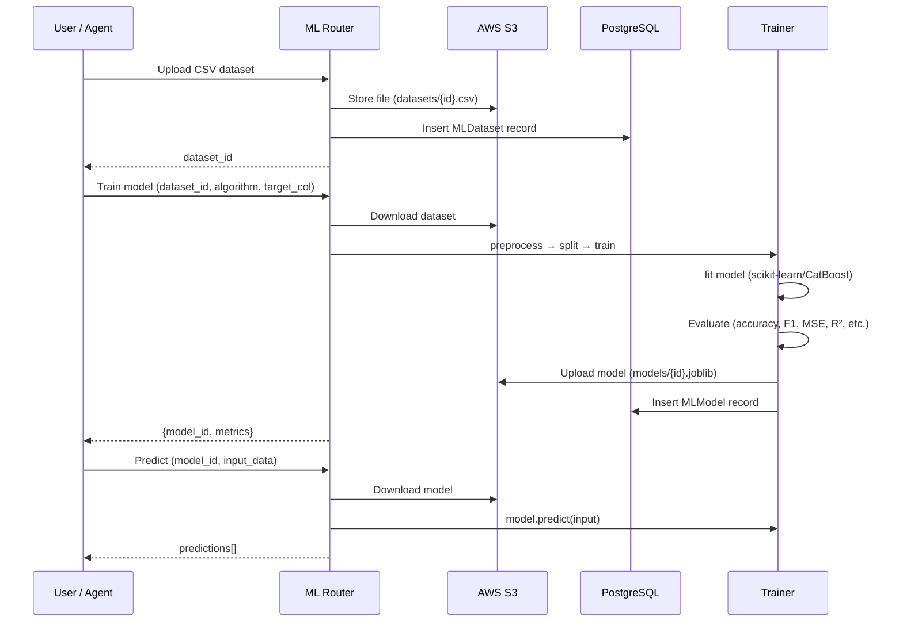

---

## 7. Database Schema (Supabase PostgreSQL)

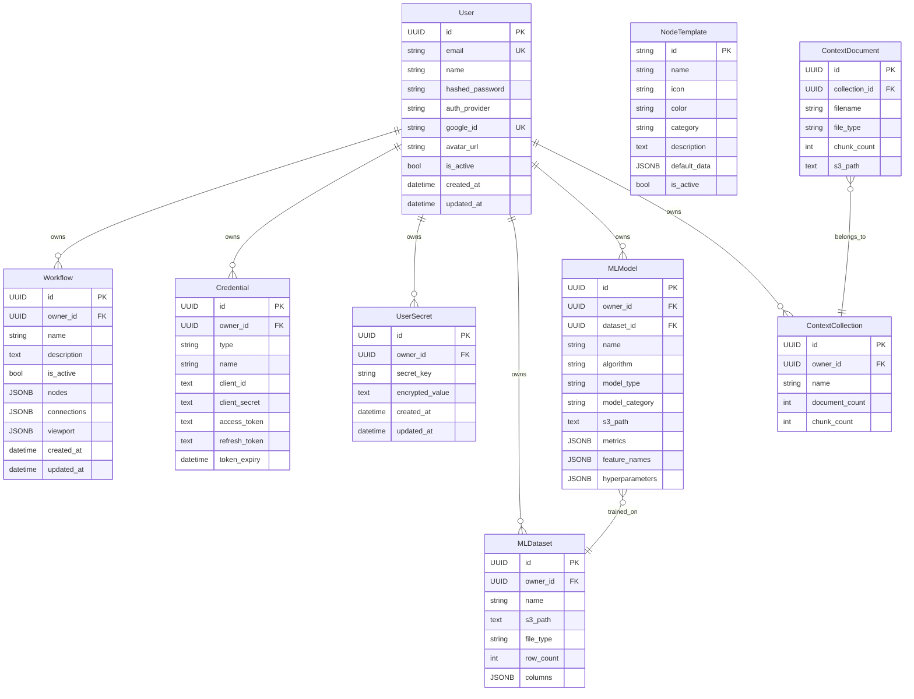

### DB Connection Details
- **Driver:** `asyncpg` (async) / `psycopg2` (sync for Alembic)
- **Pool:** `NullPool` (no connection pooling — relies on Supabase's PgBouncer)
- **Host:** `aws-1-ap-south-1.pooler.supabase.com:6543`
- **Migrations:** Alembic

---

## 8. Storage Architecture

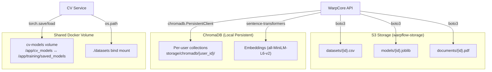

### S3 Access Patterns
1. **Server-level S3:** Default credentials from `.env` (`S3_ACCESS_KEY`, `S3_SECRET_KEY`)
2. **Per-user S3:** User stores credentials in `UserSecret` → decrypted at runtime → separate boto3 client
3. **Agent S3 tools:** User provides AWS creds as JSON in node config → `s3_service.py` builds boto3 client

---

## 9. Context Store (RAG Pipeline)

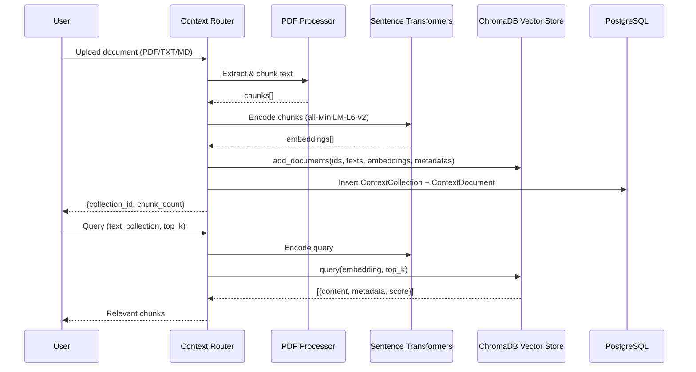

---

## 10. Frontend Architecture (WarpFlow)

| Layer | Technology |
|---|---|
| **Framework** | React 18 + TypeScript |
| **Build Tool** | Vite |
| **Styling** | Tailwind CSS |
| **State** | React Context API |
| **Routing** | React Router |

### Key Pages & Components

| File | Purpose |
|---|---|
| `WorkFlowBuilder.tsx` (45KB) | Main canvas — drag-and-drop node editor |
| `ExecuteModal.tsx` | Workflow execution dialog with real-time step display |
| `NodeConfigModal.tsx` | Per-node configuration panel |
| `WorkflowSelector.tsx` | Sidebar workflow list + CRUD |
| `AuthPage.tsx` | Login / Signup with Google OAuth |
| `ProtectedRoute.tsx` | Auth guard component |

---

## 11. Node Template Catalog (77+ nodes)

| Category | Node Types |
|---|---|
| **Triggers** | Manual, Schedule, Webhook, Email Trigger |
| **AI & ML** | OpenAI, Gemini, Anthropic, HuggingFace, AI Agent, ML Trainer, Context Store, ElevenLabs TTS, Text Analysis, Image Gen |
| **Communication** | Slack, Discord, Teams, Telegram, Email, SMS, Twilio |
| **Data & Storage** | PostgreSQL, MongoDB, Redis, MySQL, Google Sheets, Airtable, CSV |
| **Logic & Flow** | IF Condition, Switch, Loop, Merge, Split, Wait |
| **Data Processing** | Transform, Filter, Aggregate, Sort, JSON |
| **APIs & Services** | HTTP, REST API, GraphQL, Stripe, GitHub, AWS |
| **Analytics** | Google Analytics, Mixpanel, Segment |
| **Google Workspace** | Docs, Drive, Gmail, Sheets, Forms |

---

## 12. Security & Authentication

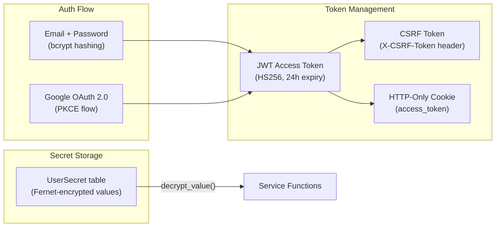

- **Rate Limiting:** SlowAPI (`20/min` for execution, `60/min` for external triggers)
- **CORS:** Restricted to `FRONTEND_URL` only
- **Credentials:** OAuth tokens stored in `Credential` table; API keys in `UserSecret` (Fernet-encrypted)
